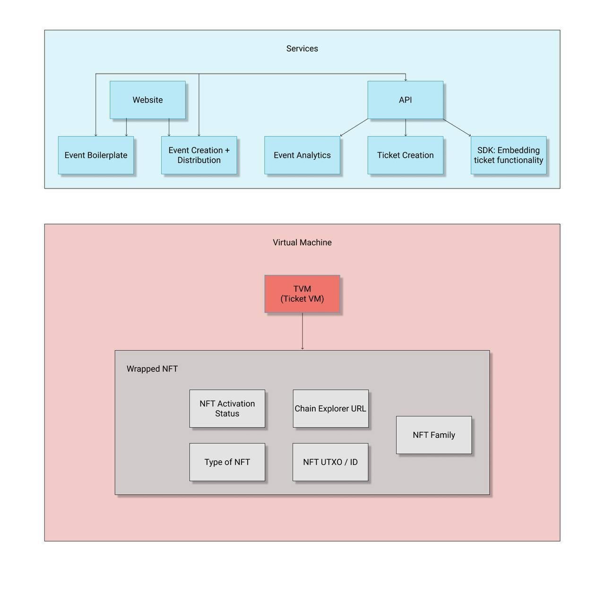

State in our system maintains the status of ticket use, tickets families and ticket families tied to event tickets. This definition will be helpful when understanding how we structured our system. Our architecture diagram is the following: 

## Requirement
- The ability to maintain state with consensus
- The ability to create sub-families for NFT collections where sub-families represent singular events
- The ability to verify creation of sub-families based on NFT collection and ticket possession

## Components
### Smart Contracts

### Frontend Dapp

### Analytics Engine
